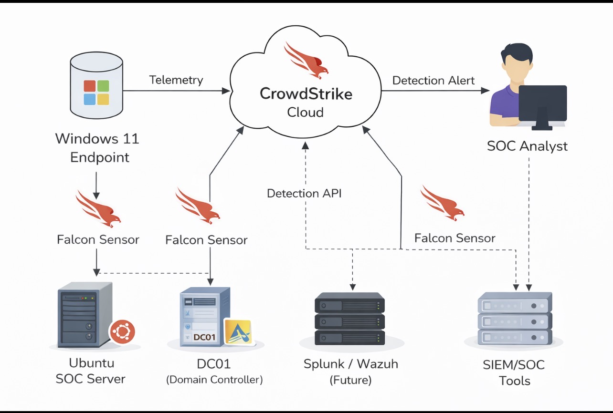
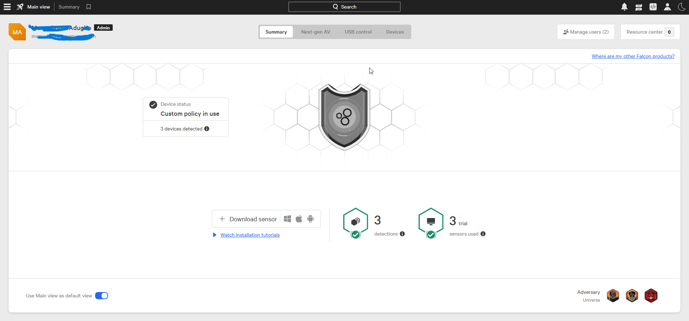
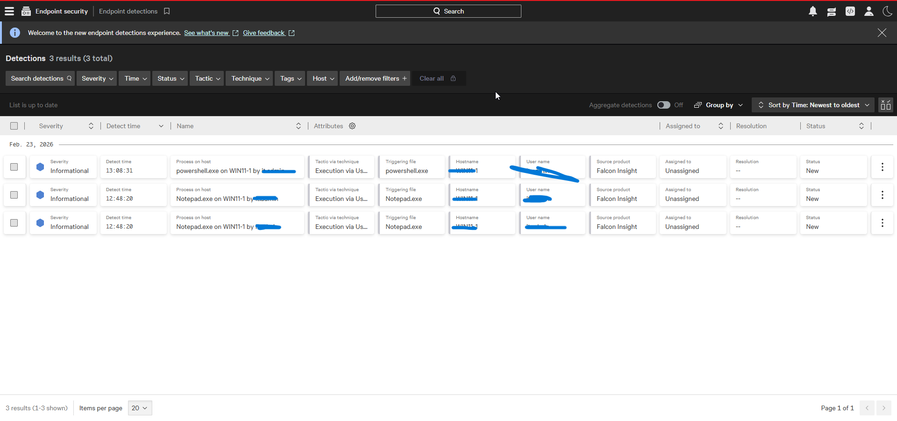
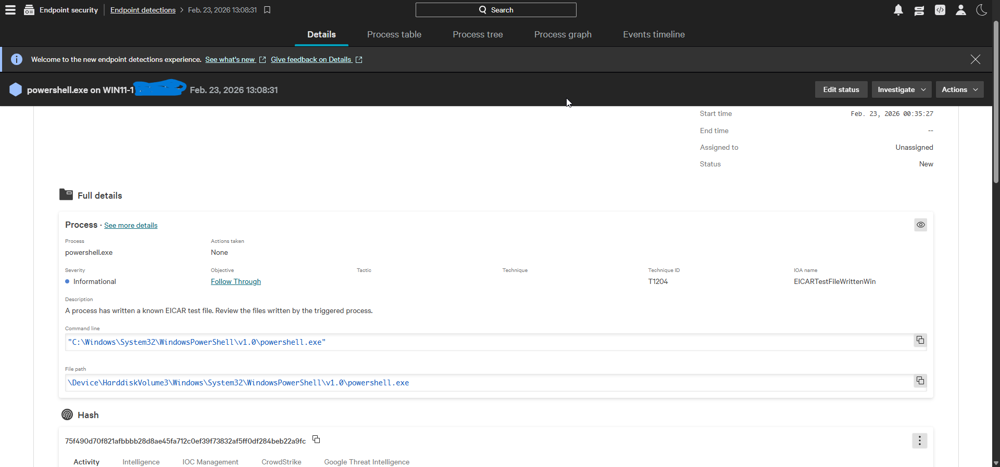

# Enterprise EDR Deployment & Detection Validation – CrowdStrike Falcon

## Architecture Diagram

---

## Overview

This project documents my hands-on deployment and validation of CrowdStrike Falcon EDR within a hybrid SOC lab environment.

The objective was to:

- Deploy Falcon sensors on Windows 11, Ubuntu Server, and Active Directory (DC01)
- Apply and validate endpoint security policies
- Generate controlled execution-based detections (EICAR test file)
- Review MITRE ATT&CK mappings
- Analyze detection telemetry from a SOC analyst perspective

---

## Lab Environment

- **WIN11-1** – Windows 11 Endpoint
- **DC01** – Active Directory Domain Controller
- **Ubuntu-SOC** – Ubuntu Server (SOC tooling)
- **CrowdStrike Falcon Insight (Trial)**
- **SIEM (separate project):** Splunk / Wazuh

Falcon Sensors were deployed on all three hosts to validate telemetry collection across a hybrid Windows + Linux + AD environment.

---

## Detection Evidence

### Falcon Detection Summary

### Detection List

### Detailed Detection View (EICAR Trigger)

---

## Sample Detection Observed

- **Process:** powershell.exe
- **User:** it.admin
- **Host:** WIN11-1
- **MITRE Tactic:** Execution
- **Technique ID:** T1204
- **Severity:** Informational
- **Source:** Falcon Insight

The EICAR test file successfully triggered a mapped execution technique (T1204), confirming:

- Endpoint telemetry visibility
- Detection logic validation
- MITRE ATT&CK mapping functionality
- Process-level inspection capability

---

## SOC Triage Approach

The following validation steps were performed:

1. Verified user legitimacy (lab admin account)
2. Reviewed process tree and parent-child relationship
3. Inspected command-line arguments
4. Confirmed activity was manually triggered for validation
5. Checked for abnormal outbound network activity
6. Documented findings

---

## Key SOC Learning

- Execution events alone are not inherently malicious
- Context determines severity (user, command-line, frequency, timing)
- Process lineage analysis is critical
- Controlled testing improves detection confidence
- Proper documentation strengthens incident response workflow

---

## Conclusion

This project demonstrates practical experience with:

- Endpoint Detection & Response (EDR)
- Detection validation & telemetry analysis
- MITRE ATT&CK mapping
- SOC triage methodology
- Hybrid environment monitoring (Windows + Linux + AD)
